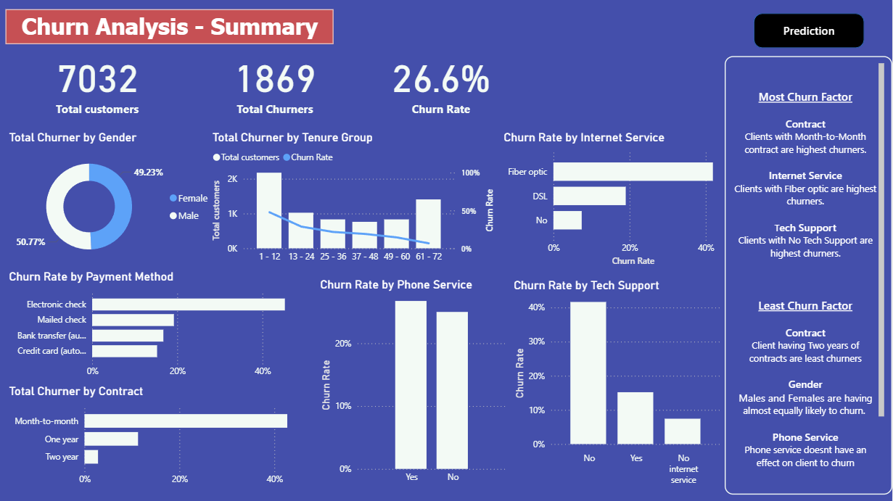
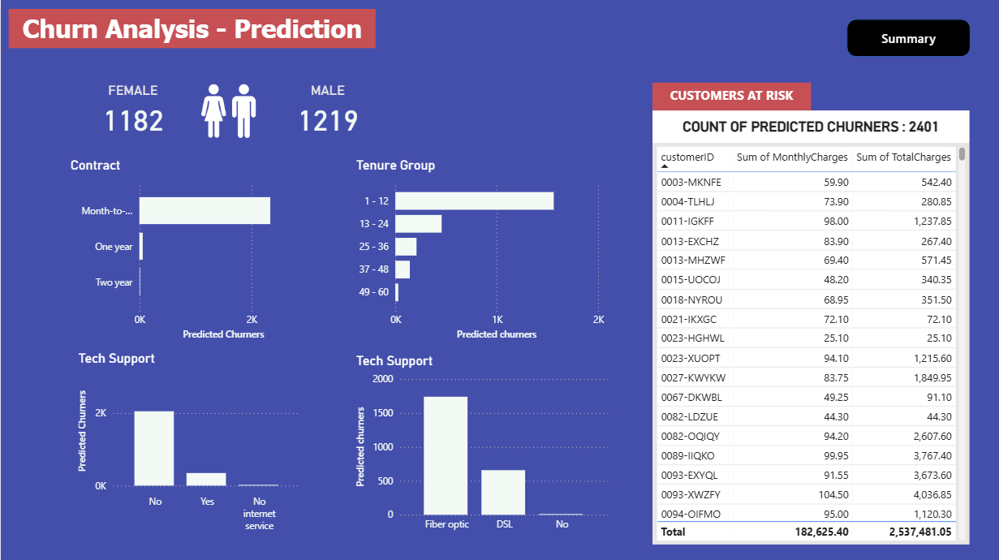

# Customer Churn Prediction  

## 📌 Project Overview  
This project focuses on **predicting customer churn** for a telecom company using **Exploratory Data Analysis (EDA), Machine Learning (Logistic Regression), and Power BI dashboards**.  
The goal is to help stakeholders understand **why customers leave** and **predict which customers are at risk**, enabling data-driven retention strategies.  

---

## 🚀 Features  
- **Exploratory Data Analysis (EDA):**  
  - Data cleaning, preprocessing, and visualization using **Python (pandas, matplotlib, seaborn)**.  
  - Identified churn patterns across **gender, tenure, payment methods, internet/phone services, and contracts**.  

- **Machine Learning Model:**  
  - Built a **Logistic Regression** classifier.  
  - Achieved **94% accuracy** in predicting customer churn.  

- **Interactive Dashboard (Power BI):**  
  - **Churn Analysis Summary:** Overall churn rate, churn by gender, contract type, internet service, and payment method.  
  - **Churn Prediction Dashboard:** Highlights customers at risk with detailed breakdown by contract, tenure, internet service, and tech support.  
  - Provides actionable insights for **business decision-making**.  

---

## 📊 Dashboard Snapshots  
### Churn Analysis - Summary  
  

### Churn Analysis - Prediction  
  

---

## 🛠 Tech Stack  
- **Python:** pandas, numpy, matplotlib, seaborn, scikit-learn  
- **Machine Learning:** Logistic Regression  
- **Visualization:** Power BI  
- **Tools:** Jupyter Notebook  

---

## 📈 Results & Insights  
- **Churn Rate:** 26.6% of customers churned.  
- **High-risk groups:**  
  - Month-to-Month contract customers.  
  - Customers with **Fiber Optic internet**.  
  - Customers with **No Tech Support**.  
- **Stable customers:**  
  - Those with **2-year contracts**.  
  - Payment via **automatic transfers (bank/credit card)**.  

---

## 🔮 Future Work  
- Experiment with advanced ML models (Random Forest, XGBoost, Neural Networks).  
- Deploy as a **web app** with real-time predictions.  
- Automate dashboard updates with live data integration.  

---
